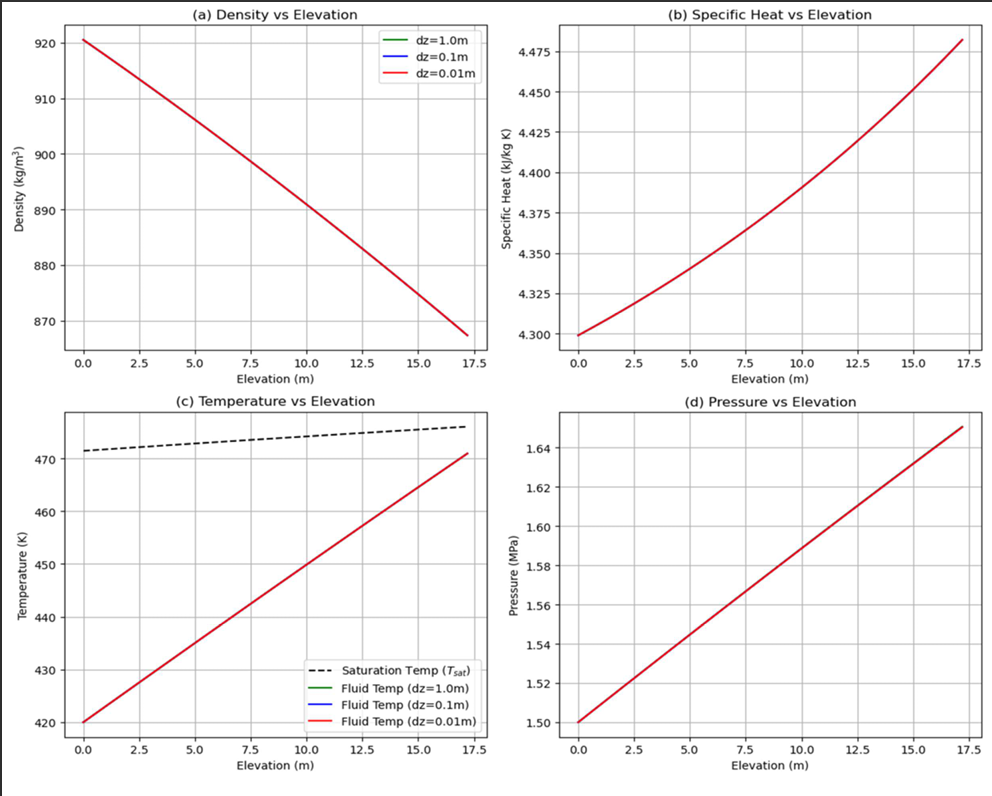

# Thermal-Hydraulic Analysis of Downward Water Flow

## 💧 Project Overview

This project performs a numerical thermal-hydraulic analysis of **downward water flow** in a vertical pipe subjected to a constant linear heat rate ($1.57 \text{ MW/m}$). The study aims to calculate pressure, temperature, and phase change parameters along the pipe length using the **Homogeneous Equilibrium Model (HEM)**.

The simulation compares **Analytical** methods (single-step global balance) with **Numerical** integration methods (finite difference with varying step sizes).

### 🔬 Methodology
* **Model:** 1D Homogeneous Equilibrium Model (HEM).
* **Fluid Properties:** High-precision water/steam properties using the **IAPWS-97** standard formulation.
* **Flow Configuration:** Downward flow (Gravity assists pressure, Friction opposes flow).
* **Numerical Method:** Finite difference method solving coupled Momentum and Energy equations.

---

## 📊 Visuals & Results

The analysis generates profiles for Density, Specific Heat ($C_p$), Temperature, and Pressure along the pipe.

*(Note: Upload the 4-subplot graph from your report to docs/graph_preview.png)*

**Results Summary:**
* The numerical solution converges as the step size decreases ($\Delta z = 0.01$ m).
* The pressure increases along the flow direction because the gravitational head ($\rho g \Delta z$) dominates over frictional losses in this specific downward flow configuration.
* Specific Heat ($C_p$) varies significantly, highlighting the importance of using temperature-dependent properties (IAPWS-97).

---

## 📂 Project Structure

    vertical-pipe-flow-analysis/
    ├── docs/
    │   └── ProjectReport.pdf      # Detailed project report
    │   └── graph_preview.png      # Graph visualization
    ├── src/
    │   └── hem_solver.py          # Main simulation code (Analytical & Numerical)
    ├── requirements.txt           # Python dependencies (iapws, etc.)
    └── README.md

---

## 🚀 How to Run

### Prerequisites
You need Python installed along with the IAPWS-97 library.

    pip install -r requirements.txt

### Running the Simulation
This script runs the analysis, prints the comparison tables, and saves the result graphs.

    python src/hem_solver.py

---

## 👨‍💻 Author

**Emre Sakarya**
* Hacettepe University, Department of Nuclear Engineering
* Project: NEM 393 Engineering Project II 

---

*For detailed physics and equations, please refer to the [Project Report](https://github.com/EmreSakarya/vertical-pipe-flow-analysis/blob/main/docs/vertical-pipe-flow-analysis.pdf)
